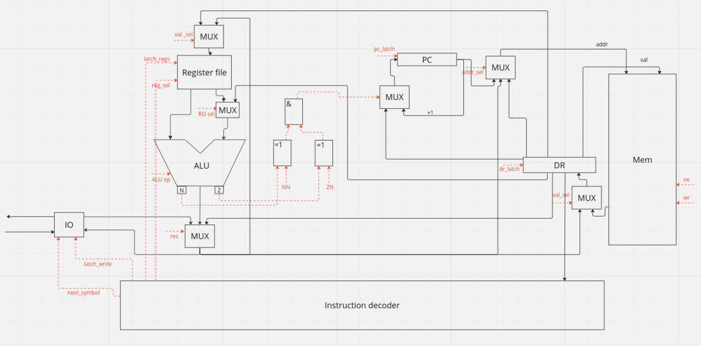

# CSA lab 3
Выполнил Голиков Андрей Сергеевич P33092
- `alg | risc | neum | hw | tick | struct | stream | port | pstr | prob2 | pipeline`
- Без усложнения


## Язык программирования
Разработанный язык похож на что-то вроде C без явной типизации.

Строки разделяются точкой с запятой. Язык поддерживает объявление и инициализацию переменных, математические операции, конструкции if, if-else, while, while-else, операции read() (читает строку из входного буфера),
read_char() (читает символ), print_str(), print_int(), и print_char(). 

Приведенные выше функции read() и пр - это просто синтаксический сахар. 

Есть только 2 типа литералов - int, str. Типизация сильная, динамическая.

Язык поддерживает области видимости, которые определяются блоками while и if.
``` ebnf
program   ::= statement | program statement
statement ::= control_flow | io | allocation | assign

assign     ::= name "=" expr
io         ::= read | print_int | print_str
allocation ::= "let" name "=" value ";"
             | "let" name "=" read_char ";"
             | "let" name "=" read ";"
read ::= "read()"
read_char ::= "read_char()"

control_flow ::= conditional | conditional else
conditional  ::= while | if
if           ::= "if" comp_expr block
else         ::= "else" block
while        ::= "while" comp_expr block
block        ::= "{" program "}"

print_str  ::= "print_str(" name ");" | "print(" string ");"
print_int  ::= "print_int(" name ");" | "print(" number ");"
print_char ::= "print_char(" name ");"

value ::= string | number
string ::= "\"[\w\s,.:;!?()\\-]+\""
comp_expr ::= "(" expr comparison_sign expr ")
expr ::= "(" expr ")" | expr op expr | number | string | name
comparison_sign ::= "==" | ">=" | ">" | "<" | "<=" | "!="
name ::= "[a-zA-Z]+"
number ::= "-?[0-9]+"
op ::= "*" | "/" | "%" | "+" | "-" | "<<" | ">>" | "&" | "|" | "^"
```

Пример программы:
```
let f1 = 1;
let f2 = 2;
let ans = f2;
let max = 4000000;
while( f1 + f2 < max ) {
  let f3 = f1 + f2;
  if (f3 % 2 == 0) {
    ans = ans + f3;
  }
  f1 = f2;
  f2 = f3;
}
print_int(ans);
```


## Организация памяти

Модель памяти процессора:
1. Память(общая). Машинное слово -- 32 бита, реализуется списком объектов класса Word.
Данные лежат там же, но вместо их опкода поставлена заглушка (JUMP)

Память программы начинается с машинных инструкций.
Далее в статической памяти лежат строки в паскальном представлении.
Затем идет специальная ячейка - ссылка на начало свободного блока для чтения из ввода(после компиляции значение этой ячейки равно адресу этой ячейки + 1)
После нее - свободная память, предназначенная для чтения строк из ввода, а в самом конце - стек
В общем схема выглядит следующим образом:
```
    +-----------------+
    |       CODE      |
    +-----------------+
    |   STATIC_DATA   |
    +-----------------+
    |      EMPTY      |
    |    SPACE PTR    |
    +-----------------+
    |      EMPTY      |
    |      SPACE      |
    +-----------------+
    |      STACK      |
    +-----------------+

```

Так как до конца компиляции размер программы неизвестен, а следовательно, и начало статической памяти, везде, где нужны адреса строк, ставятся заглушки, которые потом резолвятся.

Все переменные хранятся на стеке. При выходе из блока(while или if) указатель стека сдвигается на значение, которое было до входа в этот блок.
Для адресации переменных введен способ адресации относительно начала стека
Числовые литералы загружаются непосредственно с помощью операции LD_LIT. Так как операций со строками нет(кроме чтения), то все строки - это константы, лежащие в статической памяти.
Ссылка на них(переменная) при этом лежит на стеке.


При вычислении используется как стек, так и регистры - стек в основном используется для хранения промежуточных значений(кроме случая, когда операция всего одна), в регистрах хранятся значения переменных для вычисления


## Система команд

Особенности процессора:

- Машинное слово -- 32 бита, знаковое.
- Поток управления:
    - инкремент `PC` после каждой инструкции;
    - условные и безусловные переходы.
У команды может быть до двух аргументов.

### Набор инструкций
| Инструкция | Кол-во тактов | операнды       | Пояснение                                          |
|:-----------|---------------|:---------------|:---------------------------------------------------|
| ST_ADDR    | 4             | 2 (reg, int)   | Прямая адресация                                   |
| ST         | 5             | 2 (reg, reg)   | Косвенная адресация - в левый по адресу из правого |
| ST_STACK   | 4             | 2 (reg, int)   | Относительно конца стека                           |
| LD_ADDR    | 3             | 2 (reg, int)   | Прямая адресация                                   |
| LD_LIT     | 2             | 2 (reg, int)   | Загрузка литерала                                  |
| LD         | 4             | 2 (reg, reg)   | Косвенная адресация                                |
| LD_STACK   | 4             | 2 (reg, int)   | Относительно конца стека                           |
| MV         | 3             | 2 (reg, reg)   |                                                    |
| READ_CHAR  | 2             | 2 (reg, port)  |                                                    |
| PRINT_CHAR | 3             | 2 (reg, port)  |                                                    |
| JLE        | 3             | 1 (addr)       |                                                    |
| JL         | 3             | 1 (addr)       |                                                    |
| JGE        | 3             | 1 (addr)       |                                                    |
| JG         | 3             | 1 (addr)       |                                                    |
| JNE        | 3             | 1 (addr)       |                                                    |
| JE         | 3             | 1 (addr)       |                                                    |
| JUMP       | 3             | 1 (addr)       |                                                    |
| ADD        | 3             | 2 (reg, reg)   |                                                    |
| ADD_LIT    | 2             | 2 (reg, val)   |                                                    |
| NEG        | 2             | 1 (reg)        |                                                    |
| SHL        | 3             | 2 (reg, reg)   |                                                    |
| SHR        | 3             | 2 (reg, reg)   |                                                    |
| AND        | 3             | 2 (reg, reg)   |                                                    |
| OR         | 3             | 2 (reg, reg)   |                                                    |
| XOR        | 3             | 2 (reg, reg)   |                                                    |
| SUB        | 4             | 2 (reg, reg)   |                                                    |
| CMP        | 4             | 2 (reg1, reg2) |                                                    |
| PUSH       | 4             | 1 (reg)        |                                                    |
| POP        | 5             | 1 (reg)        |                                                    |
| INC        | 3             | 1 (reg)        |                                                    |
| DEC        | 3             | 1 (reg)        |                                                    |
| HALT       | 0             | 0              |                                                    |


Умножение и деление, функции вывода строки и числа реализованы на уровне транслятора путем вставки ассемблерного кода.

### Кодирование инструкций

- Машинный код сериализуется в список JSON.
- Один элемент списка -- одна инструкция.
- Индекс списка -- адрес инструкции. Используется для команд перехода.

Пример:

```json
[
    {"index": 209, "opcode": "JUMP", "arg1": 0, "arg2": 0}
]
```

где:

- `opcode` -- строка с кодом операции;
- `arg1`, `arg2` -- аргументы (могут отсутствовать);
- `index` -- адрес.

Типы данных в модуле [machine](./machine/isa.py), где:

- `Opcode` -- перечисление кодов операций;

## Транслятор

Интерфейс командной строки: `translator.py <input_file> <target_file>`

Реализовано в модуле: [translator](./interpreter/translator.py)

Этапы трансляции (функция `translate`):

1. Лексер - Трансформирование текста в последовательность значимых термов.
2. Парсер - перевод представления из первого этапа в АСТ.
3. Трансляция АСТ в машинный код.

Правила генерации машинного кода:

Каждая нода дерева АСТ переводится в соответсвтющее представление в ассемблерном коде. Для каждого типа ноды написан обработчик,
в котором эта нода транслируется в машинный код. Основная часть функционала языка - конструкции умножения и деления, вывода и ввода, 
циклы и ветвления - реализованы в user-space на уровне трансляции в машинный код.


## Модель процессора

Интерфейс командной строки: `machine.py <machine_code_file> <input_file>`

Реализовано в модуле: [machine](./emulator.py).

Было принято решение не разделять DataPath и ControlUnit на схеме из-за использования одной и той же памяти и там, и там, и неудобства
изображения схемы.



Модель процессора имеет 16 регистров:
```
r0 - hardwared 0

r1 - адрес начала стека, относительно этого значения берутся переменные

r2-r8 регистры общего назначения

r9, r10, r11, r12 - tmp, в r9, r10 основном используются для сохранения параметров

r13- program counter

r14 - DR - значение для записи/сохраненное после чтения в память

r15 - stack pointer
```

Ввод и вывод имеет порты

Сигналы и селекторы - oe, wr - чтение, запись из памяти

RO sel - выбор источника правого операнда

ALU op - выбор операции алу

res - выбор источника для данных(из алу, памяти, или устройства ввода)

ZN - 1, если zero не необходим, 0 иначе

NN - 1, если neg не необходим, 0 иначе

latch_reg_NUM - защелкнуть регистр

reg sel - выбрать регистр из регистрового файла

latch_write - вывести в устройство

next_symbol - ввести с устройства


- Цикл симуляции осуществляется в функции `simulation`.
- Шаг моделирования соответствует одной инструкции с выводом состояния в журнал.
- Для журнала состояний процессора используется стандартный модуль `logging`.
- Количество инструкций для моделирования лимитировано.

## Тестирование

В качестве тестов использовано 6 алгоритмов:
1. [hello world](golden/hello_world.yml).
2. [cat](golden/cat.yml) -- программа `cat`, повторяем ввод на выводе.
3. [hello user](golden/hello_user.yml). - приветствие пользователя
4. [math](golden/math.yml). - тест корректности реализации математических выражений
5. [prob2](golden/prob5.yml). - prob2
6. [prob2_optimized](golden/prob5_optimized.yml). - оптимизированный prob2 без использования деления по модулю
7. [read](golden/read.yml). - тест корректности нескольких операций чтения

Рассмотрим алгоритм Hello World. Исходный код выглядит следующим образом
```
  let hello = "Hello, world!";
  print_str(hello);
```
После компиляции
```
  [{"index": 0, "opcode": "LD_LIT", "arg1": "r3", "arg2": 0},
   {"index": 1, "opcode": "PUSH", "arg1": "r3", "arg2": 0},
   {"index": 2, "opcode": "LD_LIT", "arg1": "r4", "arg2": 17},
   {"index": 3, "opcode": "ST_STACK", "arg1": "r4", "arg2": 0},
   {"index": 4, "opcode": "LD_STACK", "arg1": "r9", "arg2": 0},
   {"index": 5, "opcode": "MV", "arg1": "r9", "arg2": "r11"},
   {"index": 6, "opcode": "INC", "arg1": "r11", "arg2": 0},
   {"index": 7, "opcode": "LD", "arg1": "r9", "arg2": "r9"},
   {"index": 8, "opcode": "LD_LIT", "arg1": "r10", "arg2": 0},
   {"index": 9, "opcode": "CMP", "arg1": "r9", "arg2": "r10"},
   {"index": 10, "opcode": "JE", "arg1": 16, "arg2": 0},
   {"index": 11, "opcode": "INC", "arg1": "r10", "arg2": 0},
   {"index": 12, "opcode": "LD", "arg1": "r12", "arg2": "r11"},
   {"index": 13, "opcode": "PRINT", "arg1": "r12", "arg2": 0},
   {"index": 14, "opcode": "INC", "arg1": "r11", "arg2": 0},
   {"index": 15, "opcode": "JUMP", "arg1": 9, "arg2": 0},
   {"index": 16, "opcode": "HALT", "arg1": 0, "arg2": 0},
   {"index": 17, "opcode": "JUMP", "arg1": 13, "arg2": 0},
   {"index": 18, "opcode": "JUMP", "arg1": 72, "arg2": 0},
   {"index": 19, "opcode": "JUMP", "arg1": 101, "arg2": 0},
   {"index": 20, "opcode": "JUMP", "arg1": 108, "arg2": 0},
   {"index": 21, "opcode": "JUMP", "arg1": 108, "arg2": 0},
   {"index": 22, "opcode": "JUMP", "arg1": 111, "arg2": 0},
   {"index": 23, "opcode": "JUMP", "arg1": 44, "arg2": 0},
   {"index": 24, "opcode": "JUMP", "arg1": 32, "arg2": 0},
   {"index": 25, "opcode": "JUMP", "arg1": 119, "arg2": 0},
   {"index": 26, "opcode": "JUMP", "arg1": 111, "arg2": 0},
   {"index": 27, "opcode": "JUMP", "arg1": 114, "arg2": 0},
   {"index": 28, "opcode": "JUMP", "arg1": 108, "arg2": 0},
   {"index": 29, "opcode": "JUMP", "arg1": 100, "arg2": 0},
   {"index": 30, "opcode": "JUMP", "arg1": 33, "arg2": 0},
   {"index": 31, "opcode": "JUMP", "arg1": 32, "arg2": 0}]
```

В начале располагаются инструкции для выполнения. После них - статическая память. Сама строка лежит после этой памяти.
Перед выполнением размер программы будет расширен, чтобы был стек

журнал выглядит следующим образом:

```
  DEBUG emulator:simulation TICK: 310 PC:  12  MEM_OUT: r12 r11 reg: 'r0': 0, 'r1': 0, 'r2': 0, 'r3': 0, 'r4': 17, 'r5': 0, 'r6': 0, 'r7': 0, 'r8': 0, 'r9': 13, 'r10': 12, 'r11': 29, 'r12': 108, 'r13': 12, 'r14': Register.r10, 'r15': 4094 	  ('12'@Opcode.LD:Register.r12 Register.r11)
  DEBUG emulator:simulation TICK: 315 PC:  13  MEM_OUT: r12 0 reg: 'r0': 0, 'r1': 0, 'r2': 0, 'r3': 0, 'r4': 17, 'r5': 0, 'r6': 0, 'r7': 0, 'r8': 0, 'r9': 13, 'r10': 12, 'r11': 29, 'r12': 100, 'r13': 13, 'r14': 100, 'r15': 4094 	  ('13'@Opcode.PRINT:Register.r12 0)
  DEBUG emulator:simulation TICK: 319 PC:  14  MEM_OUT: r11 0 reg: 'r0': 0, 'r1': 0, 'r2': 0, 'r3': 0, 'r4': 17, 'r5': 0, 'r6': 0, 'r7': 0, 'r8': 0, 'r9': 13, 'r10': 12, 'r11': 29, 'r12': 100, 'r13': 14, 'r14': Register.r12, 'r15': 4094 	  ('14'@Opcode.INC:Register.r11 0)
  DEBUG emulator:simulation TICK: 322 PC:  15  MEM_OUT: 9 0 reg: 'r0': 0, 'r1': 0, 'r2': 0, 'r3': 0, 'r4': 17, 'r5': 0, 'r6': 0, 'r7': 0, 'r8': 0, 'r9': 13, 'r10': 12, 'r11': 30, 'r12': 100, 'r13': 15, 'r14': Register.r11, 'r15': 4094 	  ('15'@Opcode.JUMP:9 0)
  DEBUG emulator:simulation TICK: 324 PC:   9  MEM_OUT: r9 r10 reg: 'r0': 0, 'r1': 0, 'r2': 0, 'r3': 0, 'r4': 17, 'r5': 0, 'r6': 0, 'r7': 0, 'r8': 0, 'r9': 13, 'r10': 12, 'r11': 30, 'r12': 100, 'r13': 9, 'r14': 9, 'r15': 4094 	  ('9'@Opcode.CMP:Register.r9 Register.r10)
  DEBUG emulator:simulation TICK: 329 PC:  10  MEM_OUT: 16 0 reg: 'r0': 0, 'r1': 0, 'r2': 0, 'r3': 0, 'r4': 17, 'r5': 0, 'r6': 0, 'r7': 0, 'r8': 0, 'r9': 13, 'r10': 12, 'r11': 30, 'r12': 100, 'r13': 10, 'r14': Register.r9, 'r15': 4094 	  ('10'@Opcode.JE:16 0)
  DEBUG emulator:simulation TICK: 331 PC:  11  MEM_OUT: r10 0 reg: 'r0': 0, 'r1': 0, 'r2': 0, 'r3': 0, 'r4': 17, 'r5': 0, 'r6': 0, 'r7': 0, 'r8': 0, 'r9': 13, 'r10': 12, 'r11': 30, 'r12': 100, 'r13': 11, 'r14': 16, 'r15': 4094 	  ('11'@Opcode.INC:Register.r10 0)
  DEBUG emulator:simulation TICK: 334 PC:  12  MEM_OUT: r12 r11 reg: 'r0': 0, 'r1': 0, 'r2': 0, 'r3': 0, 'r4': 17, 'r5': 0, 'r6': 0, 'r7': 0, 'r8': 0, 'r9': 13, 'r10': 13, 'r11': 30, 'r12': 100, 'r13': 12, 'r14': Register.r10, 'r15': 4094 	  ('12'@Opcode.LD:Register.r12 Register.r11)
```
Интеграционные тесты реализованы в [integration_test](./integration_test.py) через golden tests, конфигурация которых лежит в папке [golden](./golden).

CI:

``` yaml
name: CI

on:
  push:
    branches: [ "main" ]
  pull_request:
    branches: [ "main" ]

permissions:
  contents: read

jobs:
  lint:
    runs-on: ubuntu-latest

    steps:
    - uses: actions/checkout@v4
    - name: Install poetry
      run: pip install poetry
    - name: Set up Python 3.12
      uses: actions/setup-python@v4
      with:
        python-version: "3.12"
        cache: "poetry"
    - name: Install project
      run: |
        poetry install
    - name: Lint with ruff
      run: |
        poetry run python -m ruff interpreter
        poetry run python -m ruff machine
  test:
    runs-on: ubuntu-latest
    steps:
    - uses: actions/checkout@v4
    - name: Install poetry
      run: pip install poetry
    - name: Set up Python 3.12
      uses: actions/setup-python@v4
      with:
        python-version: "3.12"
        cache: "poetry"
    - name: Install project
      run: |
        poetry install
    - name: Run tests
      run: |
        poetry run pytest . -v --update-goldens
    needs: lint
```
- `poetry` -- управления зависимостями для языка программирования Python.
- `pytest` -- утилита для запуска тестов.
- `ruff` -- утилита для форматирования и проверки стиля кодирования.

Пример проверки исходного кода:

``` shell
$ poetry run pytest . -v --update-goldens
=================================================================================================== test session starts ===================================================================================================
platform linux -- Python 3.12.0, pytest-7.4.3, pluggy-1.3.0 -- /home/mopstream/.cache/pypoetry/virtualenvs/csa-lab3-mTPDQiQv-py3.12/bin/python
cachedir: .pytest_cache
rootdir: /home/mopstream/edu/itmo/sem5/csa
configfile: pyproject.toml
plugins: golden-0.2.2
collected 7 items                                                                                                                                                                                                         

integration_test.py::test_translator_and_machine[golden/cat.yml] PASSED                                                                                                                                             [ 14%]
integration_test.py::test_translator_and_machine[golden/hello_user.yml] PASSED                                                                                                                                      [ 28%]
integration_test.py::test_translator_and_machine[golden/prob_2_optimized.yml] PASSED                                                                                                                                [ 42%]
integration_test.py::test_translator_and_machine[golden/hello_world.yml] PASSED                                                                                                                                     [ 57%]
integration_test.py::test_translator_and_machine[golden/math.yml] PASSED                                                                                                                                            [ 71%]
integration_test.py::test_translator_and_machine[golden/read.yml] PASSED                                                                                                                                            [ 85%]
integration_test.py::test_translator_and_machine[golden/prob_2.yml] PASSED                                                                                                                                          [100%]

==================================================================================================== 7 passed in 5.47s ====================================================================================================```
```

```text
| ФИО                            | алг        | LoC |  code byte  | code instr | instr count | ticks | var
| Голиков Андрей Сергеевич       | hello      | 2   | -           | 32         | 102         | 356   | alg | risc | neum | hw | tick | struct | stream | port | pstr | prob2 | pipeline
| Голиков Андрей Сергеевич       | prob_2     | 13  | -           | 179        | 10890       | 37630 | alg | risc | neum | hw | tick | struct | stream | port | pstr | prob2 | pipeline
| Голиков Андрей Сергеевич       | hello_user | 7   | -           | 121        | 339         | 1184  | alg | risc | neum | hw | tick | struct | stream | port | pstr | prob2 | pipeline

```

